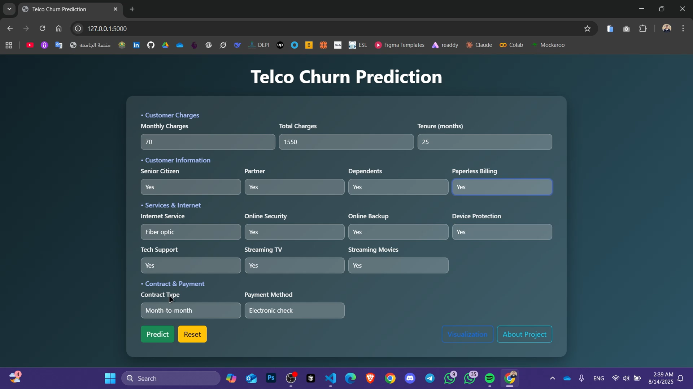
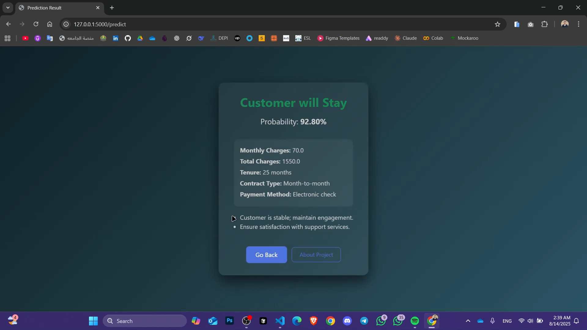

# 📊 Customer Churn Prediction with Flask

This project is a **Customer Churn Prediction** web application built using **Flask**.  
It uses a Machine Learning model to predict whether a customer is likely to leave or stay,  
based on input data such as demographics, subscription details, and usage patterns.

## 🖼️ Screenshots

### Input Page


### Results Page


## 📌 Features
- **Customer churn prediction** using a trained ML model.
- **Interactive form** for user input.
- **Data visualization** page to explore dataset patterns.
- **About page** describing the project.
- **Responsive Bootstrap-based UI**.

## 🛠️ Technologies Used
- **Backend**: Python, Flask
- **Frontend**: HTML, CSS, Bootstrap
- **Machine Learning**: Scikit-learn, Pandas, NumPy
- **Visualization**: Matplotlib / Seaborn

## 📂 Project Structure
```
.
│-- static/ # CSS and JavaScript files
│-- templates/ # HTML templates
│-- model/ # Saved models
│-- images/ # Screenshot images
│-- app.py # Main Flask application
│-- requirements.txt # Required Python libraries
│-- README.md
│-- .gitignore
```

## 🚀 How to Run Locally
1. Clone the repository:
```bash
git clone https://github.com/zeyadwaled25/customer-churn-flask.git
cd customer-churn-flask
```

2. Create a virtual environment and activate it:
```bash
python -m venv .venv
# Windows
.venv\Scripts\activate
# Mac/Linux
source .venv/bin/activate
```

3. Install dependencies:
```bash
pip install -r requirements.txt
```

4. Run the application:
```bash
python app.py
```

5. Open your browser and go to:
```
http://127.0.0.1:5000
```

## 📜 License
This project is licensed under the MIT License.